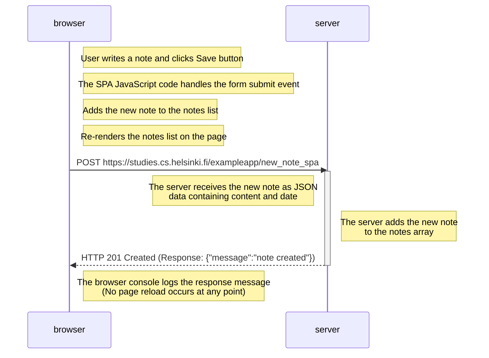

```mermaid
sequenceDiagram
    participant browser
    participant server
    
    Note right of browser: User writes a note and clicks Save button
    
    Note right of browser: The SPA JavaScript code handles the form submit event
    Note right of browser: Adds the new note to the notes list
    Note right of browser: Re-renders the notes list on the page
    
    browser->>server: POST https://studies.cs.helsinki.fi/exampleapp/new_note_spa
    activate server
    Note left of server: The server receives the new note as JSON<br/>data containing content and date
    
    Note right of server: The server adds the new note<br/>to the notes array
    
    server-->>browser: HTTP 201 Created (Response: {"message":"note created"})
    deactivate server
    
    Note right of browser: The browser console logs the response message<br/>(No page reload occurs at any point)
```